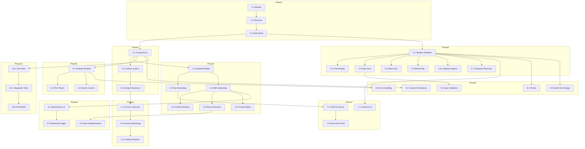

# WuffAgent - Implementation Plans

## Overview

This directory contains the phased implementation plan for WuffAgent, split by phase for pause/resume capability.

---

## Plan Files

| Phase | File | Description |
|-------|------|-------------|
|  | [`phase01_project_foundation.md`](phase01_project_foundation.md) | Go module, directory structure |
|  | [`phase02_config_management.md`](phase02_config_management.md) | Config struct, persistence |
|  |[`phase03_server_manager.md`](phase03_server_manager.md) | llama-server process management |
|  |[`phase04_chat_client.md`](phase04_chat_client.md) | HTTP client, SSE streaming |
|  |[`phase05_main_window.md`](phase05_main_window.md) | Fyne UI, chat display, input, status |
|  |[`phase06_settings_panel.md`](phase06_settings_panel.md) | Settings dialog, file pickers |
|  |[`phase07_integration.md`](phase07_integration.md) | Wire everything together |
|  |[`phase08_streaming.md`](phase08_streaming.md) | Streaming integration, stop generation |
|  |[`phase09_polish.md`](phase09_polish.md) | Theme, errors, persistence |
|  |[`phase10_testing.md`](phase10_testing.md) | Unit tests, integration tests, final build |

---

## Architecture

See [`architecture.md`](architecture.md) for the overall design.

---

## Dependency Graph



---

## Pause/Resume Guide

At any phase, run `go build` to verify compilation. If it passes, you can stop here.

To resume, check the last completed phase and start the next one.

---

## Quick Reference

| Phase | Files | Key Functions |
|-------|-------|---------------|
|  | go.mod, main.go | `go mod init`, `app.New()` |
|  | internal/config/config.go | `Config`, `LoadConfig`, `Save`, `Validate` |
|  | internal/server/manager.go | `ServerManager`, `StartServer`, `StopServer` |
|  | internal/client/chat.go | `ChatClient`, `SendMessage`, `StreamMessage`, `StopGeneration` |
|  | internal/ui/window.go | `NewChatWindow`, `DisplayMessage`, `StreamUpdate` |
|  | internal/ui/settings.go | `SettingsDialog`, `SaveConfig`, `StartServer` |
|  | main.go | `main()`, full app wiring |
|  | internal/client/chat.go, internal/ui/window.go | `StreamMessage` to UI updates |
|  | internal/ui/*.go | Theme, errors, persistence |
|  | *_test.go | Tests, build, release |

---

## Go Modules Required

```
module wuffagent

go 1.21

require github.com/fyne-io/fyne/v2 v2.5.2
```

---

## Critical Design Notes

1. **Thread Safety**: All UI updates from goroutines MUST use `app.CurrentApp().CallLater()` for Fyne widget updates.
2. **Stop Generation**: No abort endpoint in llama-server. Stop works by closing HTTP response body.
3. **SSE Parsing**: Handle partial lines, JSON per line, `[DONE]` marker.
4. **Context Window**: History truncation keeps system prompt, removes oldest messages.
4. **Config Location**: Config file is next to binary via `os.Executable()`.

---

## Review Improvements Applied

From the comprehensive review, the following critical issues were addressed:

1. **Stop Generation**: Added Step 8.3 with HTTP response closure and history cleanup
2. **Model Loading Progress**: Added Step 5.6 for loading progress indicator
3. **Thread Safety**: Added Step 4.6 for Fyne `CallLater()` documentation
4. **SSE Parsing**: Expanded Step 4.3 with detailed parsing logic
5. **Context Window**: Added Step 4.4 for history management
6. **Input Validation**: Added Step 9.4 for input validation
7. **Model Info Display**: Added Step 9.5 for model information
8. **Keyboard Shortcuts**: Added Step 5.7 for Ctrl+Enter, Escape
9. **Config Location**: Added Step 2.2 for binary-relative config path
10. **Error Handling**: Enhanced Step 9.2 with auto-reconnect

---

## Files per Phase

| Phase | Files Created/Modified |
|-------|-------------------|
|  | go.mod, go.sum, main.go |
|  | internal/config/config.go |
|  | internal/server/manager.go |
|  | internal/client/chat.go |
|  | internal/ui/window.go |
|  | internal/ui/settings.go |
|  | main.go |
|  | internal/client/chat.go, internal/ui/window.go |
|  | internal/ui/*.go, config.json |
|  | *_test.go, final binary |

---

## Next Steps

1. Review this plan
2. Start with Phase 1
3. Follow the dependency graph
