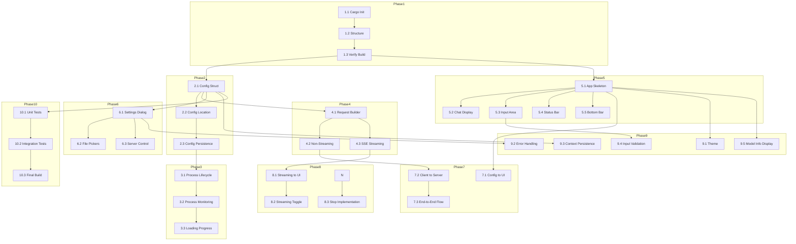

# WuffAgent - Implementation Plans (Rust)

## Overview

This directory contains the phased implementation plan for WuffAgent, built in **Rust** for performance, safety, and reliability.

---

## Technology Stack

| Component | Technology |
|-----------|------------|
| Language | **Rust** (compiled, zero-cost abstractions, memory safety) |
| UI Framework | **eframe** + **egui** (cross-platform native GUI, immediate mode) |
| HTTP Client | **reqwest** (async, streaming support) |
| Process Mgmt | **tokio** (async runtime, `tokio::process`) |
| Config | **serde** + **serde_json** |
| SSE Streaming | **reqwest** streaming |
| Backend | llama-server (llama.cpp) |

---

## Plan Files

| Phase | File | Description |
|-------|------|-------------|
| 1 | [`phase01_project_foundation.md`](phase01_project_foundation.md) | Cargo.toml, directory structure, main.rs |
| 2 | [`phase02_config_management.md`](phase02_config_management.md) | Config struct, serde, persistence |
| 3 | [`phase03_server_manager.md`](phase03_server_manager.md) | llama-server process management (tokio) |
| 4 | [`phase04_chat_client.md`](phase04_chat_client.md) | HTTP client, SSE streaming (reqwest) |
| 5 | [`phase05_main_window.md`](phase05_main_window.md) | eframe/egui window, chat display, input |
| 6 | [`phase06_settings_panel.md`](phase06_settings_panel.md) | Settings dialog, file pickers |
| 7 | [`phase07_integration.md`](phase07_integration.md) | Wire everything together |
| 8 | [`phase08_streaming.md`](phase08_streaming.md) | Streaming integration, stop generation |
| 9 | [`phase09_polish.md`](phase09_polish.md) | Theme, errors, persistence |
| 10 | [`phase10_testing.md`](phase10_testing.md) | Unit tests, integration tests, final build |

---

## Architecture

See [`architecture.md`](architecture.md) for the overall Rust design.

---

## Dependency Graph



---

## Pause/Resume Guide

At any phase, run `cargo check` to verify compilation. If it passes, you can stop here.

To resume, check the last completed phase and start the next one.

---

## Quick Reference

| Phase | Files | Key Functions |
|-------|-------|---------------|
| 1 | `Cargo.toml`, `src/main.rs` | `cargo init`, eframe setup |
| 2 | `src/config/mod.rs` | `Config`, `load`, `save`, `validate` |
| 3 | `src/server/mod.rs` | `ServerManager`, `start_server`, `stop_server` |
| 4 | `src/client/mod.rs` | `ChatClient`, `send_message`, `stream_message` |
| 5 | `src/ui/window.rs` | `ChatApp`, `draw_chat_area`, `draw_input_area` |
| 6 | `src/ui/settings.rs` | `SettingsDialog`, `save`, `start_server` |
| 7 | `src/main.rs` | `main()`, full app wiring |
| 8 | `src/client/mod.rs`, `src/ui/window.rs` | `stream_message` to UI updates |
| 9 | `src/ui/*.rs` | Theme, errors, persistence |
| 10 | Tests, final binary | `cargo test`, `cargo build --release` |

---

## Cargo.toml Dependencies

```toml
[dependencies]
eframe = "0.30"
egui = "0.30"
serde = { version = "1.0", features = ["derive"] }
serde_json = "1.0"
reqwest = { version = "0.12", features = ["stream"] }
tokio = { version = "1", features = ["full"] }
tracing = "0.1"
tracing-subscriber = { version = "0.3", features = ["env-filter"] }
dirs = "5.0"
thiserror = "1.0"
futures = "0.3"
```

---

## Critical Design Notes

1. **Async Runtime**: All async operations use tokio. The main thread is the tokio runtime.
2. **Stop Generation**: No abort endpoint in llama-server. Stop works by closing HTTP response body.
3. **SSE Parsing**: Handle partial lines, JSON per line, `[DONE]` marker.
4. **Context Window**: History truncation keeps system prompt, removes oldest messages.
5. **Config Location**: Config file is next to binary via `std::env::current_exe()`.
6. **Thread Safety**: Use `Arc<Mutex<>>` for shared state across async tasks.
7. **UI Updates**: Use `ctx.request_repaint()` for responsive streaming UI.

---

## Next Steps

1. Review this plan
2. Start with Phase 1
3. Follow the dependency graph
