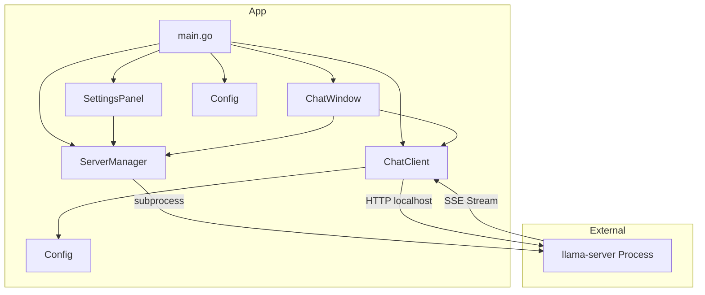

# Local AI Chat Interface - Architecture Design

## Project: WuffAgent

A standalone native GUI application for local AI chat using llama.cpp, built in **Go** for performance and reliability.

---

## Overview

WuffAgent is a **Go + Fyne** desktop application that:

1. Launches `llama-server` as a background process
2. Communicates via the local HTTP API
3. Provides a chat interface with streaming support

---

## Technology Stack

| Component | Technology |
|-----------|------------|
| Language | **Go** (compiled, no GIL, fast startup) |
| UI Framework | **Fyne** (cross-platform native GUI) |
| HTTP Client | **net/http** (stdlib, no browser, no web UI) |
| Process Mgmt | **os/exec** (stdlib subprocess) |
| Config | **encoding/json** (stdlib) |
| SSE Streaming | **bufio.Scanner** (stdlib line-by-line) |
| Backend | llama-server (llama.cpp) |

---

## File Structure

```
WuffAgent/
├── go.mod                     # Go module definition
├── go.sum                      # Dependency checksums
├── main.go                     # Entry point - init UI, start app
├── internal/
│   ├── server/
│   │   └── manager.go        # llama-server process lifecycle
│   ├── client/
│   │   └── chat.go              # HTTP communication with server
│   ├── ui/
│   │   ├── window.go          # Main chat window (Fyne)
│   │   └── settings.go       # Settings panel
│   └── config/
│       └── config.go      # JSON config load/save
└── assets/
    └── config.json       # Persistent settings storage
```

---

## Component Design

### 1. ServerManager (`internal/server/manager.go`)

**Responsibility**: Start, stop, and monitor llama-server process.

```go
type ServerManager struct {
    ServerPath string           // Path to llama-server binary
    ModelPath string          // Path to GGUF model file
    Port         int               // Server listening port
    process      *exec.Cmd // Running process handle
    mu           sync.Mutex  // Thread safety
    started      bool          // Is server running?
}

func (s *ServerManager) StartServer(cfg Config) error
func (s*ServerManager) StopServer() error
func (s*ServerManager) IsRunning() bool
func (s*ServerManager) WaitForReady(timeout time.Duration) error
```

**Process parameters:

| Parameter | Description |
|-----------|-------------|
| --model | Path to GGUF model file |
| --port | Listening port (default 8080) |
| --n-gpu-layers | GPU offloading layers |
| --n_ctx | Context window size |
| --host | Bind address (127.0.0.1 for local) |
| --threads | CPU threads |

**Lifecycle:

1. Validate binary exists
2. Build argument list from config
3. Spawn subprocess
4. Monitor stdout/stderr for errors
5. Poll `/health` endpoint until ready

---

### 2. ChatClient (`internal/client/chat.go`)

**Responsibility: Send messages to server, receive responses, handle streaming.

```go
type ChatClient struct {
    BaseURL      string
    SystemPrompt string
    Conversation []Message         // Message history
    HTTPClient   *http.Client
}

type Message struct {
    Role    string `json:"role"`
    Content string `json:"content"`
}

func (c*ChatClient) SendMessage(prompt string, stream bool) (*Response, error)
func (c *ChatClient) StreamMessage(prompt string, callback func(string) error) error
func (c*ChatClient) ClearHistory()
func (c*ChatClient) SetSystemPrompt(prompt string)
```

**API Integration:

- Endpoint: `POST /v1/chat/completions`
- Request body: OpenAI-compatible format
  ```json
  {
    "model": "local",
    "messages": [{"role":"system","content": "..."},{"role":"user","content":"..."}],
    "stream": true|false
  }
  ```
- Streaming: Parse SSE `data:` lines for incremental content

**Streaming vs Non-Streaming:
| Mode | Behavior |
|------|----------|
| Streaming | Show tokens as they arrive (SSE) |
| Non-Streaming | Wait for complete response, then display |

---

### 3. ChatWindow (`internal/ui/window.go`)

**Main chat interface window.

```go
type ChatWindow struct {
    window     fyne.Window
    server     *ServerManager
    client     *ChatClient
    chatDisplay *widget.RichText     // Message history display
    inputField  *widget.Entry   // User prompt input
    sendBtn     *widget.Button
    stopBtn    *widget.Button
    statusLabel *widget.Label
}

func (w*ChatWindow) SendMessage()
func (w*ChatWindow) DisplayMessage(role string, text string)
func (w*ChatWindow) StreamUpdate(text string)
func (w*ChatWindow) StopGeneration()
```

**UI Layout:

```
┌─────────────────────────────────┐
│  WuffAgent          [?]  │
├─────────────────────────────────┤
│  Status: ● Ready              │
├─────────────────────────────────┤
│                             │
│  User: Hello!               │
│  ──────────────────────────── │
│  Assistant: ...               │
│                             │
│  [Scrollable Chat Area]       │
│                             │
├─────────────────────────────────┤
│  [Message Input Field       ] [Send]  │
│                          [Stop] │
├─────────────────────────────────┤
│  [Settings] [Clear] [Exit]              │
└─────────────────────────────────┘
```

**Components:

| Component | Widget | Purpose |
|-------------|--------|---------|
| Status Bar | Label | Server state indicator |
| Chat Display | Scrollable container | Message history |
| Input Field | Entry | User prompt input |
| Send Button | Button | Send prompt |
| Stop Button | Button | Cancel generation |
| Settings Button | Button | Open config dialog |
| Clear Button | Button | Clear chat history |
| Theme | Light/Dark | Visual theme |
| Streaming Check | Checkbox | Toggle streaming |

---

### 4. Settings Panel (`internal/ui/settings.go`)

**Configuration dialog for server parameters.

| Setting | Widget | Description |
|---------|--------|-------------|
| Server Path | Entry | Path to llama-server binary |
| Model Path | Entry | Path to GGUF model file |
| Port | Entry | Server port (default 8080) |
| GPU Layers | Slider | Number of layers for GPU offloading |
| Context Size | Slider | Token context window |
| Threads | Slider | CPU thread count |
| System Prompt | Multi-line Entry | System prompt text |
| Streaming | Checkbox | Enable/disable streaming mode |
| Save | Button | Save to JSON |
| Start/Stop | Button | Start/Stop server |
| Test | Button | Validate settings |

---

### 5. Config (`internal/config/config.go`)

**Settings persistence and defaults.

```go
type Config struct {
    ServerPath   string
    ModelPath  string
    Port       int
    GPULayers  int
    N_CTX      int
    Threads    int
    SystemPrompt string
    Streaming  bool
    FilePath   string
}

func LoadConfig(path string) (*Config, error)
func (c*Config) Save(path string) error
func DefaultConfig() *Config
func (c*Config) Validate() error
```

**Config Schema:

```json
{
  "server_path": "C:\\path\\to\\llama-server.exe",
  "model_path": "C:\\models\\model.gguf",
  "port": 8080,
  "n_gpu_layers": 99,
  "n_ctx": 4096,
  "threads": 8,
  "system_prompt": "",
  "streaming": true
}
```

---

## Data Flow

```
User clicks Send
    │
    ▼
ChatWindow.validate_input()
    │
    ▼
ServerManager.is_running()? 
    │                    └── False→ Show error "Server not running"
    │
    ▼ (Yes)
    │
    ▼
ChatClient.send_message(prompt, stream=config.streaming)
    │
    ├── Streaming=True ──► SSE Parser ──► ChatWindow.stream_update()
    │
    └── Streaming=False ─► Complete Response ──► ChatWindow.display_message()
    │
    ▼
Update Chat Display
```

---

## Error Handling

| Scenario | Handling |
|----------|----------|
| Server binary not found | Settings validation, show file picker |
| Model file not found | Settings validation, show file picker |
| Server fails to start | Parse stderr, show error dialog |
| Server crashes during chat | Detect process exit, alert user |
| Connection timeout | Retry with exponential backoff |
| Invalid response format | Log error, show parse error message |
| Port already in use | Suggest change port or kill old process |

---

## Startup Sequence

```
1. main.go loads config
2. Validates server_path, model_path exist
3. Shows settings panel (if needed)
4. User clicks "Start" or auto-starts if configured
5. ServerManager.start_server(config)
6. ChatClient initializes
7. Fyne window opens
```

---

## Key Design Decisions

1. **No web UI** - Pure Fyne native widgets
2. **Local HTTP only** - net/http for server calls (no browser, no external deps)
3. **Streaming optional** - User chooses in settings
4. **Config persistence** - JSON file saves between sessions
5. **Graceful shutdown** - Kill server process on exit
6. **Modular design** - Server, Client, UI in separate packages
7. **Goroutine streaming** - Go goroutines for SSE parsing
8. **Theme support** - Light/dark mode with Fyne themes
9. **Compiled binary** - Single executable, no runtime needed
10. **Type safety** - Compile-time guarantees, no runtime surprises

---

## Mermaid Architecture Diagram



---

## Mermaid Sequence Diagram


---

## Next Steps

1. Initialize Go module
2. Implement Config management
3. Implement ServerManager process handling
4. Implement ChatClient API integration
5. Build ChatWindow with Fyne
6. Build SettingsPanel with file pickers
7. Add streaming support
8. Add error handling and validation
9. Test end-to-end flow
