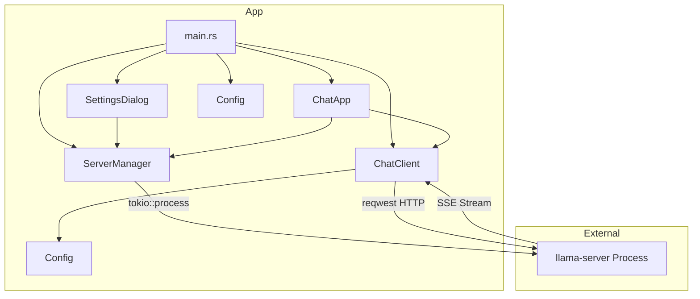
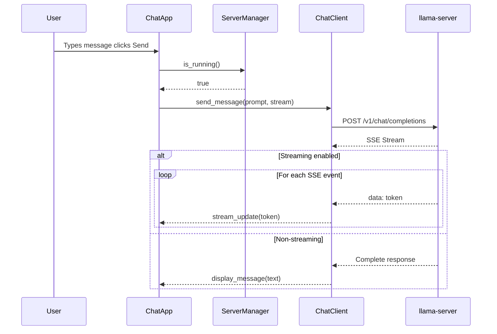

# Local AI Chat Interface - Architecture Design (Rust)

## Project: WuffAgent

A standalone native GUI application for local AI chat using llama.cpp, built in **Rust** for performance, safety, and reliability.

---

## Overview

WuffAgent is a **Rust + eframe/egui** desktop application that:

1. Launches `llama-server` as a background process
2. Communicates via the local HTTP API
3. Provides a chat interface with streaming support

---

## Technology Stack

| Component | Technology |
|-----------|------------|
| Language | **Rust** (compiled, zero-cost abstractions, memory safety) |
| UI Framework | **eframe** + **egui** (cross-platform native GUI, immediate mode) |
| HTTP Client | **reqwest** (async, streaming support) |
| Process Mgmt | **tokio** (async runtime, `tokio::process`) |
| Config | **serde** + **serde_json** (serde derive macros) |
| SSE Streaming | **reqwest** streaming or **eventsource-client** |
| Backend | llama-server (llama.cpp) |

---

## Cargo.toml

```toml
[package]
name = "wuffagent"
version = "0.1.0"
edition = "2021"

[dependencies]
eframe = "0.30"
egui = "0.30"
serde = { version = "1.0", features = ["derive"] }
serde_json = "1.0"
reqwest = { version = "0.12", features = ["stream"] }
tokio = { version = "1", features = ["full"] }
tracing = "0.1"
tracing-subscriber = { version = "0.3", features = ["env-filter"] }
dirs = "5.0"  # for config file location
```

---

## File Structure

```
WuffAgent/
├── Cargo.toml                  # Rust package manifest
├── src/
│   ├── main.rs                 # Entry point - init UI, start app
│   ├── config/
│   │   └── mod.rs              # JSON config load/save
│   ├── server/
│   │   └── mod.rs              # llama-server process lifecycle
│   ├── client/
│   │   └── mod.rs              # HTTP communication with server
│   └── ui/
│       ├── mod.rs              # App struct (eframe App)
│       ├── window.rs           # Main chat window (egui)
│       └── settings.rs         # Settings panel dialog
└── assets/
    └── config.json             # Persistent settings storage
```

---

## Component Design

### 1. ServerManager (`src/server/mod.rs`)

**Responsibility**: Start, stop, and monitor llama-server process.

```rust
use tokio::process::Command;
use tokio::sync::Mutex;
use std::sync::Arc;
use std::time::Duration;

pub struct ServerManager {
    server_path: String,
    model_path: String,
    port: u16,
    n_gpu_layers: i32,
    n_ctx: u32,
    threads: u32,
    process: Arc<Mutex<Option<tokio::process::Child>>>,
    running: Arc<std::sync::atomic::AtomicBool>,
}

impl ServerManager {
    pub fn new(cfg: &Config) -> Self { ... }
    pub async fn start_server(&self) -> Result<(), Error> { ... }
    pub async fn stop_server(&self) -> Result<(), Error> { ... }
    pub fn is_running(&self) -> bool { ... }
    pub async fn wait_for_ready(&self, timeout: Duration) -> Result<(), Error> { ... }
}
```

**Process parameters:**

| Parameter | Description |
|-----------|-------------|
| --model | Path to GGUF model file |
| --port | Listening port (default 8080) |
| --n-gpu-layers | GPU offloading layers |
| --n_ctx | Context window size |
| --host | Bind address (127.0.0.1 for local) |
| --threads | CPU threads |

**Lifecycle:**

1. Validate binary exists
2. Build argument list from config
3. Spawn subprocess via `tokio::process::Command`
4. Monitor stderr for errors
5. Poll `/health` endpoint until ready

---

### 2. ChatClient (`src/client/mod.rs`)

**Responsibility**: Send messages to server, receive responses, handle streaming.

```rust
use reqwest::Client;
use serde::{Deserialize, Serialize};

pub struct ChatClient {
    base_url: String,
    system_prompt: String,
    conversation: Vec<Message>,
    http_client: Client,
    abort_sender: Option<tokio::sync::mpsc::Sender<()>>,
}

#[derive(Serialize, Deserialize, Clone)]
pub struct Message {
    pub role: String,
    pub content: String,
}

impl ChatClient {
    pub fn new(base_url: &str) -> Self { ... }
    pub async fn send_message(&self, prompt: &str) -> Result<String, Error> { ... }
    pub async fn stream_message<F>(&self, prompt: &str, callback: F) -> Result<(), Error>
    where
        F: FnMut(String) -> Result<(), Error> + Send + Sync + 'static,
    { ... }
    pub fn stop_generation(&mut self) { ... }
    pub fn clear_history(&mut self) { ... }
    pub fn set_system_prompt(&mut self, prompt: &str) { ... }
}
```

**API Integration:**

- Endpoint: `POST /v1/chat/completions`
- Request body: OpenAI-compatible format
  ```json
  {
    "model": "local",
    "messages": [{"role":"system","content": "..."},{"role":"user","content":"..."}],
    "stream": true|false
  }
  ```
- Streaming: Parse SSE `data:` lines for incremental content

**Streaming vs Non-Streaming:**

| Mode | Behavior |
|------|----------|
| Streaming | Show tokens as they arrive (SSE) |
| Non-Streaming | Wait for complete response, then display |

---

### 3. ChatApp / ChatWindow (`src/ui/window.rs`)

**Main chat interface using eframe/egui.**

```rust
use eframe::egui;
use std::sync::{Arc, Mutex};

pub struct ChatApp {
    server: Arc<ServerManager>,
    client: Arc<Mutex<ChatClient>>,
    config: Arc<Mutex<Config>>,
    
    // UI state
    chat_display: Vec<ChatMessage>,
    input_text: String,
    is_generating: bool,
    status: ServerStatus,
    streaming: bool,
}

impl eframe::App for ChatApp {
    fn update(&mut self, ctx: &egui::Context, frame: &mut eframe::Frame) {
        // Main UI layout
    }
}
```

**UI Layout:**

```
┌─────────────────────────────────┐
│  WuffAgent          [?]  │
├─────────────────────────────────┤
│  Status: ● Ready              │
├─────────────────────────────────┤
│                                 │
│  User: Hello!                 │
│  ───────────────────────────── │
│  Assistant: ...                │
│                                 │
│  [Scrollable Chat Area]        │
│                                 │
├─────────────────────────────────┤
│  [Message Input Field       ] [Send] │
│                        [Stop]   │
├─────────────────────────────────┤
│  [Settings] [Clear] [Exit]              │
└─────────────────────────────────┘
```

**Components:**

| Component | egui Widget | Purpose |
|-----------|-------------|---------|
| Status Bar | Label | Server state indicator |
| Chat Display | ScrollArea + RichText | Message history |
| Input Field | TextEdit | User prompt input |
| Send Button | Button | Send prompt |
| Stop Button | Button | Cancel generation |
| Settings Button | Button | Open config dialog |
| Clear Button | Button | Clear chat history |
| Theme | Dark/Light | Visual theme |
| Streaming Check | Checkbox | Toggle streaming |

---

### 4. Settings Panel (`src/ui/settings.rs`)

**Configuration dialog for server parameters.**

| Setting | Widget | Description |
|---------|--------|-------------|
| Server Path | TextEdit + Button | Path to llama-server binary |
| Model Path | TextEdit + Button | Path to GGUF model file |
| Port | SpinBox | Server port (default 8080) |
| GPU Layers | Slider | Number of layers for GPU offloading |
| Context Size | Slider | Token context window |
| Threads | Slider | CPU thread count |
| System Prompt | TextEdit (multi-line) | System prompt text |
| Streaming | Checkbox | Enable/disable streaming mode |
| Save | Button | Save to JSON |
| Start/Stop | Button | Start/Stop server |

---

### 5. Config (`src/config/mod.rs`)

**Settings persistence and defaults.**

```rust
use serde::{Deserialize, Serialize};
use std::path::{Path, PathBuf};

#[derive(Serialize, Deserialize, Clone)]
pub struct Config {
    pub server_path: String,
    pub model_path: String,
    pub port: u16,
    pub n_gpu_layers: i32,
    pub n_ctx: u32,
    pub threads: u32,
    pub system_prompt: String,
    pub streaming: bool,
    pub theme: String, // "dark" | "light"
    #[serde(skip)]
    pub file_path: PathBuf,
}

impl Config {
    pub fn default_config() -> Self { ... }
    pub fn load(path: &Path) -> Result<Self, Error> { ... }
    pub fn save(&self) -> Result<(), Error> { ... }
    pub fn validate(&self) -> Result<(), Error> { ... }
    pub fn get_config_path() -> PathBuf { ... }
}
```

**Config Schema:**

```json
{
  "server_path": "C:\\path\\to\\llama-server.exe",
  "model_path": "C:\\models\\model.gguf",
  "port": 8080,
  "n_gpu_layers": 99,
  "n_ctx": 4096,
  "threads": 8,
  "system_prompt": "",
  "streaming": true,
  "theme": "dark"
}
```

---

## Data Flow

```
User clicks Send
    │
    ▼
ChatApp.validate_input()
    │
    ▼
ServerManager.is_running()?
    │                    └── False→ Show error "Server not running"
    │
    ▼ (Yes)
    │
    ▼
ChatClient.send_message(prompt, stream=config.streaming)
    │
    ├── Streaming=True ──► SSE Parser ──► ChatApp.stream_update()
    │
    └── Streaming=False ─► Complete Response ──► ChatApp.display_message()
    │
    ▼
Update Chat Display
```

---

## Error Handling

| Scenario | Handling |
|----------|----------|
| Server binary not found | Settings validation, show file picker |
| Model file not found | Settings validation, show file picker |
| Server fails to start | Parse stderr, show error dialog |
| Server crashes during chat | Detect process exit, alert user |
| Connection timeout | Retry with exponential backoff |
| Invalid response format | Log error, show parse error message |
| Port already in use | Suggest change port or kill old process |

---

## Startup Sequence

```
1. main.rs loads config
2. Validates server_path, model_path exist
3. Shows settings panel (if needed)
4. User clicks "Start" or auto-starts if configured
5. ServerManager.start_server(config)
6. ChatClient initializes
7. eframe app runs
```

---

## Key Design Decisions

1. **No web UI** - Pure egui native widgets
2. **Local HTTP only** - reqwest for server calls (async)
3. **Streaming optional** - User chooses in settings
4. **Config persistence** - JSON file saves between sessions
5. **Graceful shutdown** - Kill server process on exit
6. **Modular design** - Server, Client, UI in separate modules
7. **Async runtime** - tokio for SSE parsing and HTTP
8. **Theme support** - egui dark/light themes
9. **Compiled binary** - Single executable, no runtime needed
10. **Type safety** - Compile-time guarantees, no runtime surprises

---

## Architecture Diagram



---

## Sequence Diagram



---

## Next Steps

1. Create Cargo.toml with dependencies
2. Implement Config management
3. Implement ServerManager process handling
4. Implement ChatClient API integration
5. Build ChatApp with eframe/egui
6. Build SettingsDialog with file pickers
7. Integrate all components
8. Add streaming support
9. Polish UI and error handling
10. Add tests and final build
