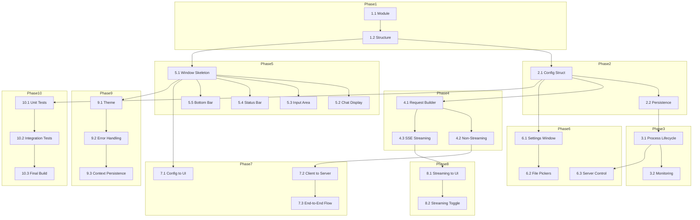

# WuffAgent - Phased Implementation Plan

## Overview

This plan is designed for **pause/resume** capability. Each phase is self-contained, and you can stop at any point and resume later without losing context.

---

## Phase 1: Project Foundation

### Step 1.1: Initialize Go Module

**Objective: Set up Go module with Fyne dependency.

**Tasks:
- Run `go mod init wuffagent`
- Create `go.mod` with `github.com/fyne-io/fyne/v2` dependency
- Create basic `main.go` with `app.New()` and `window.Create()`

**Success Criteria:
- Module initializes, `go mod tidy` succeeds

**Dependencies: None

---

### Step 1.2: Create Directory Structure

**Objective: Set up internal package layout.

**Tasks:
- Create `internal/server/`, `internal/client/`, `internal/ui/`, `internal/config/`
- Create empty `go build` succeeds

**Success Criteria:
- All directories exist
- `go build` compiles successfully

**Dependencies: Step 1.1

---

## Phase 2: Config Management

### Step 2.1: Config Struct and Defaults

**Objective: Define configuration data structure with defaults.

**Tasks:
- Create `internal/config/config.go`
- Define `Config` struct with all fields
- Implement `DefaultConfig()` function
- Implement `LoadConfig()` with JSON unmarshaling
- Implement `Save()` with JSON marshaling
- Implement `Validate()` with field validation

**Success Criteria:
- Config loads from file
- `Save()` writes valid JSON
- `Validate()` catches errors (empty paths, invalid port, etc.)

**Dependencies: Step 1.1 (module exists)

---

### Step 2.2: Config File Persistence

**Objective: Persistent settings between sessions.

**Tasks:
- Implement file read/write logic
- Handle file not found gracefully
- Return default config when file missing

**Success Criteria:
- Config file is created on first run
- Existing config is loaded on subsequent runs

**Dependencies: Step 2.1

---

## Phase 3: Server Manager

### Step 3.1: Process Lifecycle

**Objective: Start and stop llama-server process.

**Tasks:
- Create `internal/server/manager.go`
- Implement `ServerManager` struct
- `StartServer()` spawns `llama-server` with config params
- `StopServer()` sends SIGTERM, waits for exit
- `IsRunning()` checks process state
- `WaitForReady()` polls HTTP endpoint

**Success Criteria:
- Server process starts with correct arguments
- Process is running after `StartServer()`
- Server stops after `StopServer()`
- `IsRunning()` returns correct boolean
- `WaitForReady()` returns true when server responds

**Dependencies: Step 2.1 (config available)

---

### Step 3.2: Process Monitoring

**Objective: Detect server crashes, handle errors.

**Tasks:
- Monitor `Stderr` for error output
- Implement `Wait()` to detect process exit
- Log server output to console

**Success Criteria:
- Crash detection works
- Error messages are visible
- Process state is tracked

**Dependencies: Step 3.1

---

## Phase 4: Chat Client

### Step 4.1: HTTP Request Builder

**Objective: Build HTTP requests for chat completions.

**Tasks:
- Create `internal/client/chat.go`
- Define `Message`, `ChatRequest`, `Response` structs
- Implement `buildRequest()` method
- Serialize to JSON, create HTTP request

**Success Criteria:
- JSON matches OpenAI API format
- Request includes system prompt, message history

**Dependencies: Step 2.1 (config for base URL)

---

### Step 4.2: Non-Streaming Response Handling

**Objective: Send request, receive complete response.

**Tasks:
- Implement `SendMessage()` with `stream: false`
- Parse JSON response
- Return content to caller

**Success Criteria:
- Complete response text is returned
- Error handling for HTTP failures

**Dependencies: Step 4.1

---

### Step 4.3: SSE Streaming

**Objective: Stream tokens as they arrive.

**Tasks:
- Implement `StreamMessage()` with `stream: true`
- Parse SSE `data:` lines
- Call callback for each token chunk
- Use goroutine for async updates

**Success Criteria:
- Callback fires for each token
- Streaming completes on `[DONE]` marker
- Can cancel streaming with context

**Dependencies: Step 4.1

---

## Phase 5: Main Window

### Step 5.1: Window Skeleton

**Objective: Create basic Fyne window with layout.

**Tasks:
- Create `internal/ui/window.go`
- Create `NewChatWindow()` returning `fyne.Window`
- Set window title, size
- Add placeholder content

**Success Criteria:
- Window opens, titled "WuffAgent"
- Content is visible

**Dependencies: Step 2.1 (config, Step 3.1 (server manager available)

---

### Step 5.2: Chat Display Area

**Objective: Scrollable chat message history.

**Tasks:
- Add `widget.RichText` for display
- Implement `DisplayMessage()` to add messages
- Add scrollbar, auto-scroll

**Success Criteria:
- Messages display in order
- Scrollbar appears when content overflows
- New messages are visible

**Dependencies: Step 5.1

---

### Step 5.3: Input Area

**Objective: User input field and send button.

**Tasks:
- Add `widget.Entry` for input
- Add `widget.Button` for send
- Add `widget.Button` for stop
- Wire send button to submit
- Wire stop button to cancel

**Success Criteria:
- User can type in input field
- Send button triggers submission
- Stop button is visible during generation

**Dependencies: Step 5.1

---

### Step 5.4: Status Bar

**Objective: Show server state (connecting, ready, generating, error).

**Tasks:
- Add `widget.Label` for status
- Update on server state changes
- Color-code: green=ready, blue=generating, red=error, gray=connecting

**Success Criteria:
- Status text changes based on state
- Colors are visible

**Dependencies: Step 5.3 (buttons are present

**Dependencies: Step 5.1

---

### Step 5.5: Bottom Bar

**Objective: Settings, Clear, and theme buttons.

**Tasks:
- Add `widget.Button` for settings
- Add `widget.Button` for clear history
- Add `widget.Button` for theme toggle

**Success Criteria:
- All buttons visible
- Buttons are functional

**Dependencies: Step 5.2 (chat display exists)

---

## Phase 6: Settings Panel

### Step 6.1: Settings Window

**Objective: Settings dialog with server config fields.

**Tasks:
- Create `internal/ui/settings.go`
- Add fields for server_path, model_path, port, gpu_layers, ctx_size, threads, system_prompt
- Add save, cancel, start, stop buttons

**Success Criteria:
- Settings window opens
- All fields visible
- Save writes to JSON

**Dependencies: Step 2.1 (config struct exists)

---

### Step 6.2: File Pickers

**Objective: Allow browsing for server and model paths.

**Tasks:
- Add file picker dialogs for server_path, model_path
- Validate selected file exists
- Update config fields

**Success Criteria:
- File picker opens
- Selected paths are saved

**Dependencies: Step 6.1

---

### Step 6.3: Server Control

**Objective: Start/stop server from settings.

**Tasks:
- Wire start/stop buttons to server manager
- Show status in settings
- Validate paths before starting

**Success Criteria:
- Server starts with selected paths
- Server stops correctly

**Dependencies: Step 3.1 (server manager)

---

## Phase 7: Integration

### Step 7.1: Wire Config to UI

**Objective: Load config at startup, save on close.

**Tasks:
- `main.go` loads config
- Pass config to window
- Save config before exit

**Success Criteria:
- Settings persist between runs
- Window uses loaded config

**Dependencies: Step 5.1, Step 6.1

---

### Step 7.2: Wire Client to Server

**Objective: Chat client connects to running server.

**Tasks:
- Window sends messages via client
- Client uses config for base URL

**Success Criteria:
- Messages go to server
- Responses come back

**Dependencies: Step 4.1, Step 5.1

---

### Step 7.3: End-to-End Flow

**Objective: Complete chat cycle works.

**Tasks:
- User types message
- Client sends to server
- Response displays in chat
- History updates

**Success Criteria:
- Full round-trip works
- Chat history updates

**Dependencies: All previous phases

---

## Phase 8: Streaming Integration

### Step 8.1: Streaming to UI

**Objective: Streaming responses update UI in real time.

**Tasks:
- Wire `StreamMessage` to chat display
- Each token chunk appears immediately
- Progress updates as tokens arrive

**Success Criteria:
- Tokens show in chat area as they stream

**Dependencies: Step 4.3, Step 5.2

---

### Step 8.2: Streaming Toggle

**Objective: User selects streaming mode.

**Tasks:
- Settings checkbox controls streaming
- Client checks config before sending

**Success Criteria:
- Checkbox enables/disables streaming

**Dependencies: Step 8.1, Step 6.1

---

## Phase 9: Polish

### Step 9.1: Theme Support

**Objective: Light/dark theme toggle.

**Tasks:
- Add theme button to UI
- Toggle Fyne theme
- Persist preference in config

**Success Criteria:
- Theme changes are visible

**Dependencies: Step 5.1

---

### Step 9.2: Error Handling

**Objective: Robust error recovery.

**Tasks:
- Show error dialogs for failures
- Handle server disconnects
- Auto-reconnect if server drops

**Success Criteria:
- Errors are caught
- User is informed
- Recovery is possible

**Dependencies: All phases

---

### Step 9.3: Context Persistence

**Objective: Save chat history between sessions.

**Tasks:
- Export/import chat history
- Save on close, load on startup

**Success Criteria:
- Chat history survives restarts

**Dependencies: Step 2.1, Step 5.1

---

## Phase 10: Testing

### Step 10.1: Unit Tests

**Objective: Core logic tests.

**Tasks:
- Test config load/save
- Test request building
- Test message parsing

**Success Criteria:
- `go test` passes

**Dependencies: Steps 2.1, 4.1

---

### Step 10.2: Integration Tests

**Objective: Server manager and client tests.

**Tasks:
- Test server start/stop cycle
- Test chat flow with mock server

**Success Criteria:
- Process management works
- API calls are correct

**Dependencies: Step 3.1, Step 4.1

---

### Step 10.3: End-to-End Build

**Objective: Compile final binary.

**Tasks:
- Build with `go build`
- Test on Windows
- Verify single executable works

**Success Criteria:
- Binary runs on Windows
- No external runtime needed

**Dependencies: All phases

---

## Dependency Graph



---

## Quick Reference

| Phase | Files | Key Functions |
|------|-------|---------------|
| 1 | go.mod, main.go | `go mod init`, `app.New()` |
| 2 | internal/config/config.go | `Config`, `LoadConfig`, `Save`, `Validate` |
| 3 | internal/server/manager.go | `ServerManager`, `StartServer`, `StopServer` |
| 4 | internal/client/chat.go | `ChatClient`, `SendMessage`, `StreamMessage` |
| 5 | internal/ui/window.go | `NewChatWindow`, `DisplayMessage`, `StreamUpdate` |
| 6 | internal/ui/settings.go | `SettingsDialog`, `SaveConfig`, `StartServer` |
| 7 | main.go | `main()`, full app wiring |
| 8 | internal/client/chat.go | `StreamMessage` to UI updates |
| 9 | internal/ui/*.go | Theme, errors, persistence |
| 10 | *_test.go | Tests, build, release |

---

## Pause/Resume Guide

At any phase, run `go build` to verify compiles. If it passes, you can stop here.

To resume, check the last completed phase and start the next one.

---

## Estimated Files per Phase

| Phase | Files Created/Modified |
|-------|-------------------|
| 1 | go.mod, go.sum, main.go |
| 2 | internal/config/config.go |
| 3 | internal/server/manager.go |
| 4 | internal/client/chat.go |
| 5 | internal/ui/window.go |
| 6 | internal/ui/settings.go |
| 7 | main.go |
| 8 | internal/client/chat.go, internal/ui/window.go |
| 9 | internal/ui/*.go, config.json |
| 10 | *_test.go, final binary |

---

## Go Modules Required

```
module wuffagent

go 1.21

require github.com/fyne-io/fyne/v2 v2.5.2
```
