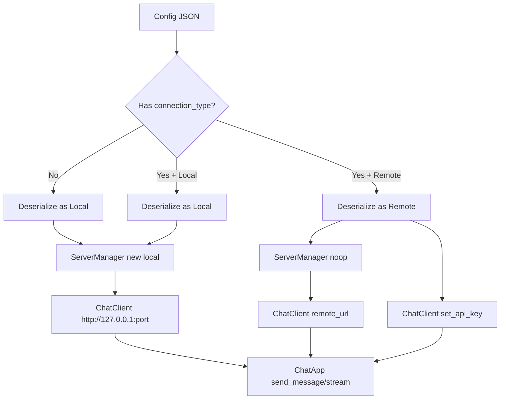

# Phase 11: Remote llama.cpp Server Connection Support

## Overview

Extend WuffAgent to support connecting to a remote llama.cpp server in addition to the existing local llama-server process support. This is a backward-compatible change — existing configs continue to work without modification.

## Architecture Decision Record

**Decision:** Add a `connection_type` enum to Config, making `server_path` and `model_path` optional. The client layer (`ChatClient`) already accepts any `base_url` and makes no local/remote assumptions, so it needs only a URL update mechanism. The `ServerManager` is retained for local mode and conditionally instantiated from main.

**Why not a separate config struct?** Keeping a single Config avoids duplicating shared fields (`system_prompt`, `streaming`, `theme`, `chat_history`, `n_ctx`, `threads`). The "local-only" fields become `Option<String>` / `Option<u16>` etc. and are simply ignored in remote mode.

---

## 1. Config Changes (`src/config/mod.rs`)

### 1.1 New `ConnectionType` enum

```rust
#[derive(Serialize, Deserialize, Clone, Debug, PartialEq)]
pub enum ConnectionType {
    #[serde(rename = "local")]
    Local,
    #[serde(rename = "remote")]
    Remote,
}

impl Default for ConnectionType {
    fn default() -> Self {
        Self::Local
    }
}
```

### 1.2 Updated `Config` struct

```rust
#[derive(Serialize, Deserialize, Clone, Debug)]
pub struct Config {
    pub connection_type: ConnectionType,
    pub remote_url: String,          // e.g. "http://192.168.1.100:8080"
    pub remote_api_key: Option<String>, // optional authentication

    // Local-mode fields (required when connection_type == Local)
    pub server_path: String,
    pub model_path: String,
    pub port: u16,
    pub n_gpu_layers: i32,
    pub n_ctx: u32,
    pub threads: u32,

    // Shared fields
    pub system_prompt: String,
    pub streaming: bool,
    pub theme: String,
    pub chat_history: Vec<ChatMessage>,
    #[serde(skip)]
    pub file_path: PathBuf,
}
```

### 1.3 Updated `Default` impl

```rust
impl Default for Config {
    fn default() -> Self {
        Self {
            connection_type: ConnectionType::Local,
            remote_url: String::new(),
            remote_api_key: None,
            server_path: String::new(),
            model_path: String::new(),
            port: 8080,
            n_gpu_layers: 99,
            n_ctx: 4096,
            threads: 8,
            system_prompt: String::new(),
            streaming: true,
            theme: "dark".to_string(),
            chat_history: Vec::new(),
            file_path: PathBuf::new(),
        }
    }
}
```

### 1.4 Updated `validate()` method

```rust
pub fn validate(&self) -> Result<(), Error> {
    match self.connection_type {
        ConnectionType::Local => {
            if self.server_path.is_empty() {
                return Err(Error::EmptyServerPath);
            }
            if self.model_path.is_empty() {
                return Err(Error::EmptyModelPath);
            }
            if !Path::new(&self.server_path).exists() {
                return Err(Error::ServerPathNotFound(self.server_path.clone()));
            }
            if !Path::new(&self.model_path).exists() {
                return Err(Error::ModelPathNotFound(self.model_path.clone()));
            }
            if self.port < 1024 || self.port > 65535 {
                return Err(Error::InvalidPort(self.port));
            }
            if self.threads == 0 || self.threads > 64 {
                return Err(Error::InvalidThreads(self.threads));
            }
            if self.n_gpu_layers < 0 || self.n_gpu_layers > 99 {
                return Err(Error::InvalidGPULayers(self.n_gpu_layers));
            }
        }
        ConnectionType::Remote => {
            if self.remote_url.is_empty() {
                return Err(Error::EmptyRemoteUrl);
            }
            // Basic URL validation: must start with http:// or https://
            if !self.remote_url.starts_with("http://") && !self.remote_url.starts_with("https://") {
                return Err(Error::InvalidRemoteUrl(self.remote_url.clone()));
            }
        }
    }
    Ok(())
}
```

### 1.5 New `Error` variants

```rust
#[derive(Debug, thiserror::Error)]
pub enum Error {
    #[error("Server path is empty")]
    EmptyServerPath,
    #[error("Model path is empty")]
    EmptyModelPath,
    #[error("Server path not found: {0}")]
    ServerPathNotFound(String),
    #[error("Model path not found: {0}")]
    ModelPathNotFound(String),
    #[error("Remote URL is empty")]
    EmptyRemoteUrl,
    #[error("Invalid remote URL: {0} (must start with http:// or https://)")]
    InvalidRemoteUrl(String),
    #[error("Invalid port: {0}")]
    InvalidPort(u16),
    #[error("Invalid threads: {0}")]
    InvalidThreads(u32),
    #[error("Invalid GPU layers: {0}")]
    InvalidGPULayers(i32),
    #[error("IO error: {0}")]
    Io(#[from] std::io::Error),
    #[error("JSON error: {0}")]
    Json(#[from] serde_json::Error),
}
```

### 1.6 Backward compatibility

Existing config files **do not contain** `connection_type`, `remote_url`, or `remote_api_key`. With the current struct definition, deserialization of old configs would fail because the new fields have no defaults.

**Solution: Implement `Deserialize` manually with fallback defaults.**

```rust
impl Default for Config { /* ... as above ... */ }

// Custom deserialization that fills in missing legacy fields
impl<'de> Deserialize<'de> for Config {
    fn deserialize<D>(deserializer: D) -> Result<Self, D::Error>
    where
        D: serde::Deserializer<'de>,
    {
        #[derive(Deserialize)]
        struct LegacyConfig {
            server_path: String,
            model_path: String,
            port: u16,
            n_gpu_layers: i32,
            n_ctx: u32,
            threads: u32,
            system_prompt: String,
            streaming: bool,
            theme: String,
            chat_history: Vec<ChatMessage>,
            // Optional new fields — present only in remote-mode configs
            connection_type: Option<ConnectionType>,
            remote_url: Option<String>,
            remote_api_key: Option<String>,
        }

        let legacy = LegacyConfig::deserialize(deserializer)?;

        Ok(Self {
            connection_type: legacy.connection_type.unwrap_or_default(),
            remote_url: legacy.remote_url.unwrap_or_default(),
            remote_api_key: legacy.remote_api_key,
            server_path: legacy.server_path,
            model_path: legacy.model_path,
            port: legacy.port,
            n_gpu_layers: legacy.n_gpu_layers,
            n_ctx: legacy.n_ctx,
            threads: legacy.threads,
            system_prompt: legacy.system_prompt,
            streaming: legacy.streaming,
            theme: legacy.theme,
            chat_history: legacy.chat_history,
            file_path: PathBuf::new(), // set later by caller
        })
    }
}
```

The `#[derive(Serialize)]` is kept so new configs write out the full schema. The custom `Deserialize` handles the transition seamlessly.

### 1.7 New helper method

```rust
impl Config {
    /// Returns the base URL to use for the ChatClient.
    /// For local mode: http://127.0.0.1:{port}
    /// For remote mode: the configured remote_url
    pub fn base_url(&self) -> String {
        match self.connection_type {
            ConnectionType::Local => format!("http://127.0.0.1:{}", self.port),
            ConnectionType::Remote => self.remote_url.clone(),
        }
    }

    /// Returns true if this config is in remote mode.
    pub fn is_remote(&self) -> bool {
        matches!(self.connection_type, ConnectionType::Remote)
    }
}
```

---

## 2. Client Changes (`src/client/mod.rs`)

### 2.1 No struct changes needed

`ChatClient` already accepts any `base_url`. The existing `set_url()` method is sufficient.

### 2.2 Add optional API key support

When `remote_api_key` is set in config, the client should include it in requests. Two options:

**Option A (simplest): Add `api_key` field to `ChatClient`**

```rust
pub struct ChatClient {
    pub base_url: String,
    pub system_prompt: String,
    pub conversation: Arc<Mutex<Vec<Message>>>,
    pub http_client: reqwest::Client,
    pub api_key: Option<String>,
}

impl ChatClient {
    pub fn new(base_url: &str) -> Self {
        Self {
            base_url: base_url.to_string(),
            system_prompt: String::new(),
            conversation: Arc::new(Mutex::new(Vec::new())),
            http_client: reqwest::Client::new(),
            api_key: None,
        }
    }

    pub fn set_api_key(&mut self, key: Option<&str>) {
        self.api_key = key.map(|s| s.to_string());
    }
}
```

**Add key to request headers in `send_message` and `stream_message`:**

```rust
fn build_headers(&self) -> reqwest::header::HeaderMap {
    let mut headers = reqwest::header::HeaderMap::new();
    headers.insert("Content-Type", "application/json".parse().unwrap());
    if let Some(ref key) = self.api_key {
        headers.insert(
            "Authorization",
            format!("Bearer {}", key).parse().unwrap(),
        );
    }
    headers
}
```

Then replace `.header("Content-Type", ...)` calls with `self.build_headers()` in both `send_message` and `stream_message`.

### 2.3 Update model name (optional improvement)

The `model` field in `ChatRequest` is hardcoded to `"local"`. For remote servers this may matter (e.g., OpenAI-compatible APIs often expect the actual model name). Leave as `"local"` for now to avoid breaking changes; the user can note this as a future enhancement.

---

## 3. Main Wiring Changes (`src/main.rs`)

```rust
fn main() -> eframe::Result {
    let options = eframe::NativeOptions {
        viewport: egui::ViewportBuilder::default().with_inner_size([900.0, 700.0]),
        ..Default::default()
    };

    let config_path = config::get_config_path();
    let config = match Config::load(&config_path) {
        Ok(cfg) => Arc::new(Mutex::new(cfg)),
        Err(e) => {
            eprintln!("Failed to load config: {}, using defaults", e);
            Arc::new(Mutex::new(Config::default()))
        }
    };

    // Conditionally create ServerManager (only for local mode)
    let cfg = config.lock().unwrap();
    let server = if cfg.is_remote() {
        // Remote mode: create a no-op server manager (never used, but required by ChatApp)
        drop(cfg);
        Arc::new(ServerManager::noop())
    } else {
        let server = Arc::new(ServerManager::new(
            &cfg.server_path,
            &cfg.model_path,
            cfg.port,
            cfg.n_gpu_layers,
            cfg.n_ctx,
            cfg.threads,
        ));
        drop(cfg);
        server
    };

    // Create chat client with the correct base URL
    let base_url = config.lock().unwrap().base_url();
    let mut client = ChatClient::new(&base_url);
    if let ConnectionType::Remote = config.lock().unwrap().connection_type {
        let key = config.lock().unwrap().remote_api_key.clone();
        client.set_api_key(key.as_deref());
    }
    let client = Arc::new(Mutex::new(client));

    eframe::run_native(
        "WuffAgent",
        options,
        Box::new(|_cc| Ok(Box::new(ChatApp::new(server, client, config)))),
    )
}
```

### 3.1 Add `ServerManager::noop()`

```rust
impl ServerManager {
    pub fn noop() -> Self {
        Self {
            server_path: String::new(),
            model_path: String::new(),
            port: 0,
            n_gpu_layers: 0,
            n_ctx: 0,
            threads: 0,
            process: Arc::new(Mutex::new(None)),
            running: Arc::new(std::sync::atomic::AtomicBool::new(false)),
            error: Arc::new(std::sync::Mutex::new(None)),
        }
    }
}
```

This returns a "dead" ServerManager that always reports `is_running() == false`. The settings dialog will hide Start/Stop buttons in remote mode anyway, so this object is never called.

---

## 4. Settings UI Changes (`src/ui/settings.rs`)

### 4.1 Updated `SettingsDialog` struct

```rust
pub struct SettingsDialog {
    pub show: bool,
    pub connection_type: ConnectionType,
    pub remote_url: String,
    pub remote_api_key: String,      // stored as plain String in UI; None when empty
    pub server_path: String,
    pub model_path: String,
    pub port: u16,
    pub n_gpu_layers: i32,
    pub n_ctx: u32,
    pub threads: u32,
    pub system_prompt: String,
    pub streaming: bool,
    pub theme: String,
}
```

### 4.2 Updated `new()` constructor

```rust
pub fn new(config: &Config) -> Self {
    Self {
        show: false,
        connection_type: config.connection_type.clone(),
        remote_url: config.remote_url.clone(),
        remote_api_key: config.remote_api_key.clone().unwrap_or_default(),
        server_path: config.server_path.clone(),
        model_path: config.model_path.clone(),
        port: config.port,
        n_gpu_layers: config.n_gpu_layers,
        n_ctx: config.n_ctx,
        threads: config.threads,
        system_prompt: config.system_prompt.clone(),
        streaming: config.streaming,
        theme: config.theme.clone(),
    }
}
```

### 4.3 Layout changes

The dialog is split into **three sections** with conditional visibility:

```
┌─────────────────────────────────────────┐
│  Settings                               │
├─────────────────────────────────────────┤
│  Connection Type                        │
│    (○) Local    (●) Remote              │
├─────────────────────────────────────────┤
│  [REMOTE section — shown when Remote]   │
│  Remote URL:   [http://192.168.1.100:8080]│
│  API Key:     [sk-..._________________] │
├─────────────────────────────────────────┤
│  [LOCAL section — shown when Local]     │
│  Server Path: [C:\llama\llama-server.exe] [...]│
│  Model Path:  [C:\models\model.gguf    ] [...]│
│  ─────────────────────────────────      │
│  Port:        [=====8080=====]          │
│  GPU Layers:  [=====99=====]            │
│  Context Size:[=====4096=====]          │
│  Threads:     [========8========]       │
├─────────────────────────────────────────┤
│  System Prompt:                         │
│  [Enter system prompt...              ] │
│  [ ] Streaming                          │
│  Theme: [Dark ●]  [Light ○]             │
├─────────────────────────────────────────┤
│  Server Status: ● Running               │
│  [Save]  [Start Server]  [Stop Server]  │  ← local only
│  [Cancel]                               │
└─────────────────────────────────────────┘
```

### 4.4 Conditional rendering in `show_dialog`

The `show_dialog` method needs to branch on `connection_type`:

```rust
pub fn show_dialog(
    &mut self,
    ctx: &egui::Context,
    server: &Arc<ServerManager>,
    client: &Arc<Mutex<ChatClient>>,
    config: &Arc<Mutex<Config>>,
) {
    // Capture all fields (same as before...)

    egui::Window::new("Settings").vscroll(true).show(ctx, |ui| {
        ui.heading("Connection Settings");
        ui.separator();

        // Connection type radio buttons
        ui.horizontal(|ui| {
            ui.label("Connection Type:");
            if ui.selectable_value(&mut self.connection_type, ConnectionType::Local, "Local").clicked() {}
            if ui.selectable_value(&mut self.connection_type, ConnectionType::Remote, "Remote").clicked() {}
        });
        ui.separator();

        // Remote-mode fields
        if matches!(self.connection_type, ConnectionType::Remote) {
            ui.horizontal(|ui| {
                ui.label("Remote URL:");
                ui.text_edit_singleline(&mut self.remote_url);
            });
            ui.horizontal(|ui| {
                ui.label("API Key:");
                ui.password_edit(&mut self.remote_api_key); // egui's password field
            });
            ui.separator();
        }

        // Local-mode fields
        if matches!(self.connection_type, ConnectionType::Local) {
            // Server path with file picker button
            ui.horizontal(|ui| {
                ui.label("Server Path:");
                ui.text_edit_singleline(&mut self.server_path);
                #[cfg(feature = "rfd")]
                if ui.button("...").clicked() { /* file picker */ }
            });
            // Model path with file picker button
            ui.horizontal(|ui| {
                ui.label("Model Path:");
                ui.text_edit_singleline(&mut self.model_path);
                #[cfg(feature = "rfd")]
                if ui.button("...").clicked() { /* file picker */ }
            });
            ui.separator();

            // Port slider
            ui.add(egui::Slider::new(&mut self.port, 1024..=65535).text("Port"));
            // GPU Layers slider
            ui.add(egui::Slider::new(&mut self.n_gpu_layers, 0..=99).text("GPU Layers"));
            // Context Size slider
            ui.add(egui::Slider::new(&mut self.n_ctx, 512..=32768).text("Context Size"));
            // Threads slider
            ui.add(egui::Slider::new(&mut self.threads, 1..=64).text("Threads"));
            ui.separator();
        }

        // Shared fields (shown in both modes)
        ui.label("System Prompt:");
        ui.add(egui::TextEdit::multiline(&mut self.system_prompt)
            .desired_rows(3)
            .hint_text("Enter system prompt..."));

        ui.checkbox(&mut self.streaming, "Streaming");

        ui.horizontal(|ui| {
            ui.label("Theme:");
            if ui.selectable_value(&mut self.theme, "dark".to_string(), "Dark").clicked() {}
            if ui.selectable_value(&mut self.theme, "light".to_string(), "Light").clicked() {}
        });

        ui.separator();

        // Server status — show always, but text differs for remote
        ui.horizontal(|ui| {
            ui.label("Server Status:");
            if matches!(self.connection_type, ConnectionType::Remote) {
                ui.label(egui::RichText::new("Remote (connected)").color(egui::Color32::GREEN));
            } else {
                let running = server.is_running();
                let status_text = if running { "Running" } else { "Stopped" };
                let status_color = if running { egui::Color32::GREEN } else { egui::Color32::RED };
                ui.label(egui::RichText::new(status_text).color(status_color));
            }
        });

        // Buttons
        ui.horizontal(|ui| {
            if ui.button("Save").clicked() {
                let mut cfg = config.lock().unwrap();
                cfg.connection_type = self.connection_type.clone();
                cfg.remote_url = self.remote_url.clone();
                cfg.remote_api_key = if self.remote_api_key.is_empty() {
                    None
                } else {
                    Some(self.remote_api_key.clone())
                };
                cfg.server_path = self.server_path.clone();
                cfg.model_path = self.model_path.clone();
                cfg.port = self.port;
                cfg.n_gpu_layers = self.n_gpu_layers;
                cfg.n_ctx = self.n_ctx;
                cfg.threads = self.threads;
                cfg.system_prompt = self.system_prompt.clone();
                cfg.streaming = self.streaming;
                cfg.theme = self.theme.clone();
                if let Err(e) = cfg.save() {
                    eprintln!("Failed to save config: {}", e);
                }
                ctx.send_viewport_cmd(egui::ViewportCommand::Close);
            }

            // Start Server — local only
            if matches!(self.connection_type, ConnectionType::Local) {
                if ui.button("Start Server").clicked() {
                    // ... existing start logic (unchanged) ...
                }
            }

            // Stop Server — local only
            if matches!(self.connection_type, ConnectionType::Local) {
                if ui.button("Stop Server").clicked() {
                    // ... existing stop logic (unchanged) ...
                }
            }

            if ui.button("Cancel").clicked() {
                ctx.send_viewport_cmd(egui::ViewportCommand::Close);
            }
        });
    });

    // Sync back to self
    // ...
}
```

### 4.5 Note on egui password field

egui provides `ui.password_edit(&mut text)` for the API key field (renders as masked input). This is available in egui 0.30.

---

## 5. ChatApp Changes (`src/ui/window.rs`)

### 5.1 Update client URL on config change

Currently, the settings dialog updates the client URL directly when "Start Server" is clicked (line 213-216 of settings.rs). For remote mode, the URL update should happen on "Save" instead, since there is no local server to start.

The cleanest approach: after the settings dialog closes (on Save), the main window should re-read the config and update the client. This can be done in the `ChatApp` by checking for config changes, or simply by having the settings dialog call `client.lock().unwrap().set_url(&config.lock().unwrap().base_url())` before closing.

**Recommended approach — update client in the Save handler of settings.rs:**

When "Save" is clicked, after saving the config, also update the client:

```rust
if ui.button("Save").clicked() {
    // ... save config (as above) ...
    
    // Update client URL and API key
    let new_url = config.lock().unwrap().base_url();
    let mut cl = client.lock().unwrap();
    cl.set_url(&new_url);
    let api_key = config.lock().unwrap().remote_api_key.as_deref();
    cl.set_api_key(api_key);
    
    ctx.send_viewport_cmd(egui::ViewportCommand::Close);
}
```

### 5.2 No other ChatApp changes needed

The main chat loop already uses `base_url` from the client, so it automatically works with remote URLs.

---

## 6. Tests to Add/Update

### 6.1 Config tests (`src/config/mod.rs`)

```rust
#[test]
fn test_config_remote_mode_validation() {
    let mut cfg = Config::default();
    cfg.connection_type = ConnectionType::Remote;
    cfg.remote_url = "http://192.168.1.100:8080".to_string();
    assert!(cfg.validate().is_ok());
}

#[test]
fn test_config_remote_mode_missing_url() {
    let mut cfg = Config::default();
    cfg.connection_type = ConnectionType::Remote;
    assert_eq!(cfg.validate().unwrap_err(), Error::EmptyRemoteUrl);
}

#[test]
fn test_config_remote_mode_invalid_url() {
    let mut cfg = Config::default();
    cfg.connection_type = ConnectionType::Remote;
    cfg.remote_url = "ftp://bad-url".to_string();
    assert_eq!(cfg.validate().unwrap_err(), Error::InvalidRemoteUrl(...));
}

#[test]
fn test_config_serialize_deserialize_roundtrip_remote() {
    // Verify remote config serializes and deserializes correctly
}

#[test]
fn test_config_backward_compat_deserialize() {
    // Deserialize an old-style JSON (no connection_type field)
    // and verify it defaults to Local
}

#[test]
fn test_config_base_url_local() {
    let cfg = Config::default();
    assert_eq!(cfg.base_url(), "http://127.0.0.1:8080");
}

#[test]
fn test_config_base_url_remote() {
    let mut cfg = Config::default();
    cfg.connection_type = ConnectionType::Remote;
    cfg.remote_url = "http://example.com:3000".to_string();
    assert_eq!(cfg.base_url(), "http://example.com:3000");
}
```

### 6.2 Client tests (`src/client/mod.rs`)

```rust
#[test]
fn test_build_headers_no_api_key() {
    // Verify Content-Type is set, Authorization is not
}

#[test]
fn test_build_headers_with_api_key() {
    // Verify both Content-Type and Authorization Bearer are set
}
```

---

## 7. Migration / Upgrade Path

| Scenario | Behavior |
|----------|----------|
| First install (no config) | Creates default config with `connection_type: Local` |
| Existing local config (no `connection_type` field) | Custom `Deserialize` fills in `Local` as default |
| Existing local config with empty `remote_url` | Treated as Local; `remote_url` ignored |
| New remote config | User selects "Remote" in settings, enters URL, saves |
| Switching from Remote back to Local | User selects "Local" in settings; remote_url/api_key preserved in config but ignored until switched back |

---

## 8. Files to Modify

| File | Change |
|------|--------|
| `src/config/mod.rs` | Add `ConnectionType` enum, update `Config` struct, add custom `Deserialize`, update `validate()`, add new `Error` variants, add `base_url()` and `is_remote()` helpers |
| `src/client/mod.rs` | Add `api_key` field to `ChatClient`, add `set_api_key()`, add `build_headers()`, use in `send_message`/`stream_message` |
| `src/server/mod.rs` | Add `ServerManager::noop()` |
| `src/main.rs` | Conditional `ServerManager` creation, use `config.base_url()`, set API key on client |
| `src/ui/settings.rs` | Add connection type selector, conditional field sections, conditional Start/Stop buttons, update Save handler to also update client |
| `src/ui/window.rs` | No changes needed (client URL is updated by settings dialog) |
| `tests/integration_tests.rs` | Add integration tests for remote config roundtrip |

---

## 9. Mermaid: Data Flow



---

## 10. Implementation Order

1. **`src/config/mod.rs`** — `ConnectionType` enum, updated `Config`, custom `Deserialize`, updated `validate()`, new `Error` variants, `base_url()` / `is_remote()` helpers, tests
2. **`src/client/mod.rs`** — `api_key` field, `set_api_key()`, `build_headers()`, tests
3. **`src/server/mod.rs`** — `ServerManager::noop()`
4. **`src/main.rs`** — conditional ServerManager creation, `base_url()` usage, API key wiring
5. **`src/ui/settings.rs`** — connection type UI, conditional sections, updated Save handler
6. **`tests/integration_tests.rs`** — integration tests
