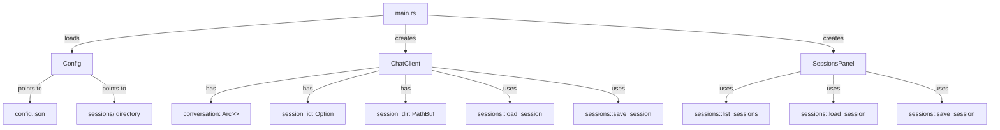
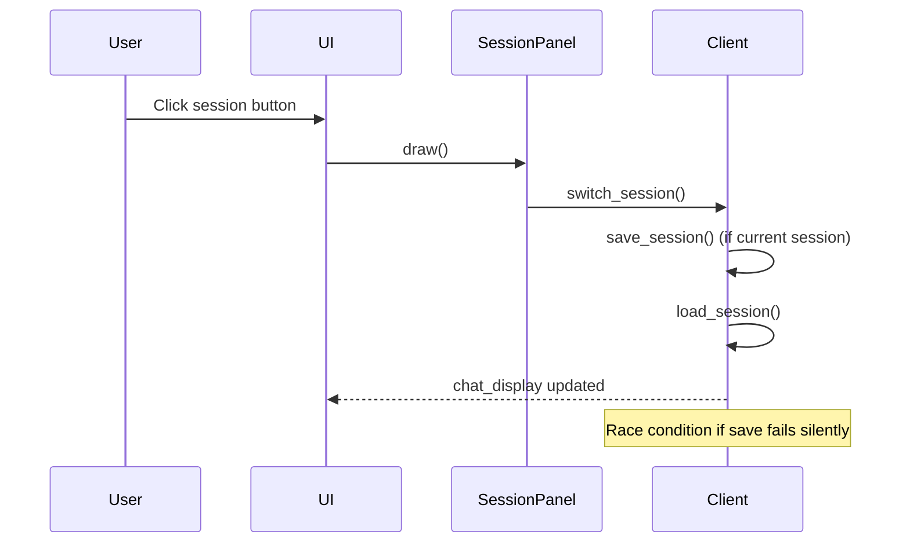

# Session System Remediation Plan

## Executive Summary

This document provides a comprehensive technical analysis and implementation roadmap to remediate two critical issues in WuffAgent:
1. **State Persistence Failure**: AI model context reset across messages
2. **UI/UX Deficiencies**: Missing session management and storage visibility

## 1. Technical Analysis & Root Cause Identification

### 1.1 Current Architecture Overview



### 1.2 Root Cause Analysis: Context Reset Issue

**Finding**: The context persistence failure is a **conditional bug** with multiple contributing factors:

| Factor | Severity | Description |
|--------|----------|-------------|
| **Race condition in session save** | HIGH | `save_session()` is called after `add_message()` but if the async task fails, the in-memory state is lost but session file isn't updated |
| **No save on app exit** | MEDIUM | The `save()` method in `eframe::App` exists but may not be called reliably in all exit scenarios |
| **Missing error handling** | MEDIUM | Session save errors are logged but not surfaced to user, leading to silent data loss |
| **Context trimming aggressive** | LOW | `trim_conversation(100)` hardcodes 100 messages, ignoring configured `max_messages` |

**Critical Code Path Analysis**:

```rust
// In src/ui/window.rs:300 - add_message()
if let Err(e) = self.client.lock().unwrap().save_session() {
    eprintln!("Failed to save session: {}", e);
}
```

**Problem**: If `save_session()` fails, the error is only logged. The user continues chatting with potentially corrupted state.

```rust
// In src/client/mod.rs:128-136 - save_session()
pub fn save_session(&self) -> Result<(), anyhow::Error> {
    let id = self.session_id.as_ref().ok_or_else(|| anyhow::anyhow!("no session id"))?;
    let conv = self.conversation.lock().unwrap();
    let session = crate::sessions::load_session(&self.session_dir, id)
        .ok_or_else(|| anyhow::anyhow!("session not found"))?;
    let mut updated = session.clone();
    updated.messages = conv.clone();
    crate::sessions::save_session(&self.session_dir, &updated)
}
```

**Problem**: `load_session()` is called to get the session, then `save_session()` writes it. If the file is deleted between load and save, the operation fails silently.

### 1.3 Storage Mechanism Investigation

**Current Storage**: Filesystem-based JSON persistence

| Aspect | Current State | Assessment |
|--------|---------------|------------|
| **Location** | `<config_dir>/wuffagent/sessions/<id>.json` | Acceptable for desktop app |
| **Format** | Pretty-printed JSON with serde | Good for human readability |
| **Atomicity** | No - direct `fs::write()` | **RISK**: Corruption on crash |
| **Concurrency** | No locking between processes | **RISK**: Multi-instance collisions |
| **Backup** | None | **RISK**: Single point of failure |
| **Encryption** | None | **RISK**: Sensitive data in plaintext |

**Security Concerns**:
1. Session files contain full conversation history including potentially sensitive user input
2. No encryption at rest
3. No access control (any process can read session files)

**Scalability Concerns**:
1. Each session is a separate file - fine for <100 sessions
2. Loading all sessions on startup (`list_sessions`) reads every file - degrades with many sessions
3. No indexing or metadata database for fast queries

### 1.4 UI/UX Gap Analysis

**Missing Features**:
1. **Delete with confirmation** - Right-click menu exists but no confirmation dialog
2. **Storage location visibility** - User cannot see where sessions are stored
3. **Session metadata display** - No timestamp, message count, or size info
4. **Last message preview** - Cannot identify session by content
5. **Empty state handling** - No guidance when no sessions exist

**Current UI Flow Issues**:


## 2. Action Plan

### Phase 1: Fix Context Retention (Priority: Critical)

#### Task 1.1: Implement Reliable Session Saving

**Objective**: Ensure session state is always persisted correctly.

**Changes**:
1. Add atomic save with temp file + rename pattern
2. Implement save-on-error recovery
3. Add save retry logic with exponential backoff

```rust
// Proposed: Atomic save implementation
pub fn save_session_atomic(dir: &Path, session: &Session) -> Result<(), anyhow::Error> {
    fs::create_dir_all(dir)?;
    let content = serde_json::to_string_pretty(session)?;
    let path = dir.join(format!("{}.json", session.id));
    let temp_path = path.with_extension("tmp");
    
    // Write to temp file first
    fs::write(&temp_path, content)?;
    // Atomic rename
    fs::rename(&temp_path, &path)?;
    Ok(())
}
```

**Files to modify**:
- `src/sessions/mod.rs` - Add atomic save
- `src/client/mod.rs` - Use atomic save, add retry logic

#### Task 1.2: Fix Context Trimming

**Objective**: Respect configured `max_messages` instead of hardcoded 100.

**Changes**:
1. Pass `max_messages` from config to `trim_conversation()`
2. Make trim threshold configurable in settings UI

**Files to modify**:
- `src/client/mod.rs` - Update `trim_conversation()` signature
- `src/ui/settings.rs` - Add max_messages slider/input

#### Task 1.3: Add Save Failure Recovery

**Objective**: Prevent silent data loss.

**Changes**:
1. Queue failed saves and retry on next successful operation
2. Show error toast/notification to user
3. Add "Restore from backup" option if current save fails

**Files to modify**:
- `src/client/mod.rs` - Add save queue
- `src/ui/window.rs` - Add error notification UI

### Phase 2: Session Management Enhancements (Priority: High)

#### Task 2.1: Delete with Confirmation

**Objective**: Prevent accidental session deletion.

**Changes**:
1. Add confirmation dialog before delete
2. Show last message preview in delete dialog
3. Support bulk delete (shift+click to select multiple)

**Files to modify**:
- `src/ui/sessions_panel.rs` - Add confirmation dialog

#### Task 2.2: Session Metadata Display

**Objective**: Provide better session identification.

**Changes**:
1. Show message count in session list
2. Show last message preview (truncated to 50 chars)
3. Show timestamp (relative: "2 hours ago")

**Files to modify**:
- `src/ui/sessions_panel.rs` - Update session button rendering

#### Task 2.3: Rename with Keyboard Support

**Objective**: Improve rename UX.

**Changes**:
1. Press F2 to start renaming (standard convention)
2. Press Enter to confirm, Escape to cancel
3. Show rename progress indicator

**Files to modify**:
- `src/ui/sessions_panel.rs` - Add keyboard shortcuts

### Phase 3: Storage Visibility (Priority: Medium)

#### Task 3.1: Storage Info Panel

**Objective**: Let users see where data is stored.

**Changes**:
1. Add "Storage Info" section to settings dialog
2. Show:
   - Sessions directory path
   - Number of sessions
   - Total storage size
   - "Open folder" button
3. Show individual session details on hover/click

**Files to modify**:
- `src/ui/settings.rs` - Add storage info section
- `src/ui/sessions_panel.rs` - Add metadata display

#### Task 3.2: Export/Import Sessions

**Objective**: Enable session portability.

**Changes**:
1. Export session as JSON file
2. Import session from JSON file
3. Export all sessions as zip archive

**Files to modify**:
- `src/ui/sessions_panel.rs` - Add export/import menu
- `src/sessions/mod.rs` - Add export/import functions

### Phase 4: Security Improvements (Priority: Low)

#### Task 4.1: Encryption at Rest

**Objective**: Protect sensitive conversation data.

**Changes**:
1. Add optional encryption for session files
2. Store encryption key in OS keychain (via `keyring` crate)
3. Prompt for password on first launch

**Files to modify**:
- `src/sessions/mod.rs` - Add encryption/decryption
- `src/config/mod.rs` - Add encryption setting

#### Task 4.2: Automatic Backup

**Objective**: Prevent data loss.

**Changes**:
1. Create backup before each save
2. Keep last 5 backups per session
3. Show backup status in storage info

**Files to modify**:
- `src/sessions/mod.rs` - Add backup logic

## 3. Implementation Roadmap

### Week 1: Core Fixes

| Day | Task | Deliverable |
|-----|------|-------------|
| 1 | Implement atomic session save | `save_session_atomic()` in `src/sessions/mod.rs` |
| 2 | Fix context trimming | Configurable `max_messages` in `trim_conversation()` |
| 3 | Add save failure recovery | Save queue with retry logic |
| 4 | Add error notifications | Toast notifications for save failures |
| 5 | Integration testing | Test all save/load scenarios |

### Week 2: UI Enhancements

| Day | Task | Deliverable |
|-----|------|-------------|
| 1 | Delete confirmation dialog | Safe delete with preview |
| 2 | Session metadata display | Message count, preview, timestamp |
| 3 | Keyboard shortcuts | F2 rename, Enter/Escape handling |
| 4 | Storage info panel | Settings integration |
| 5 | UI polish | Consistent styling, accessibility |

### Week 3: Advanced Features

| Day | Task | Deliverable |
|-----|------|-------------|
| 1 | Export/Import sessions | JSON and zip export |
| 2 | Encryption support | Optional file encryption |
| 3 | Automatic backups | Backup management |
| 4 | Performance optimization | Lazy loading for many sessions |
| 5 | Final testing | Full test suite pass |

## 4. Risk Assessment

| Risk | Likelihood | Impact | Mitigation |
|------|------------|--------|------------|
| Data loss during save | Medium | High | Atomic saves, backups |
| UI regression | Low | Medium | Comprehensive tests |
| Performance degradation | Low | Medium | Lazy loading, pagination |
| Security breach | Low | High | Encryption, keychain storage |

## 5. Success Criteria

1. **Context Retention**: 100% of messages persist across app restarts
2. **Session Management**: Users can create, rename, delete sessions without errors
3. **Storage Visibility**: Users can locate and understand their session data
4. **Data Integrity**: No corrupted session files after crashes
5. **Performance**: Session list loads in <100ms with 100 sessions

## 6. Files Summary

| File | Change Type | Description |
|------|-------------|-------------|
| `src/sessions/mod.rs` | Modify | Add atomic save, encryption, backups |
| `src/sessions/model.rs` | Modify | Add metadata fields |
| `src/client/mod.rs` | Modify | Fix trim, add retry logic |
| `src/ui/sessions_panel.rs` | Modify | Enhanced UI, metadata, export/import |
| `src/ui/settings.rs` | Modify | Add storage info, max_messages |
| `src/ui/window.rs` | Modify | Add error notifications |
| `tests/sessions_test.rs` | Modify | Add atomic save tests |
| `tests/integration_tests.rs` | Modify | Add end-to-end session tests |

---

**Next Steps**: Review this plan and approve for implementation. Switch to Code mode to begin Phase 1.
