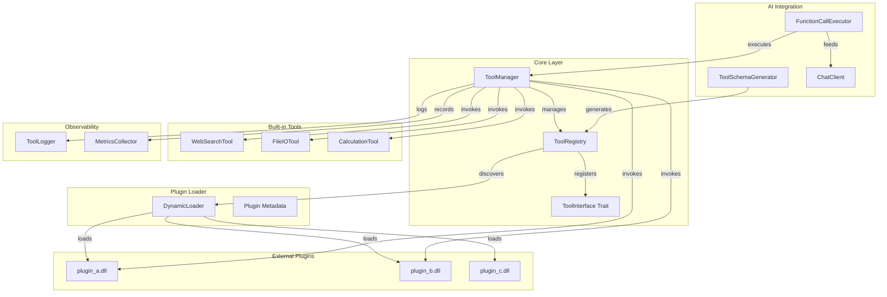

# WuffAgent Tool Interface System — Architecture Design

## Overview

A plugin-based tool registry system that allows AI agents to discover, load, and invoke tools at runtime. Each tool is a self-contained library module implementing a standardized interface. Tools are dynamically loaded from `.dll` (Windows) / `.so` (Linux/macOS) files without requiring an application restart.

## Architecture Diagram



---

## Module Structure

```
src/tools/
├── lib.rs          # Core traits, types, error definitions
├── registry.rs     # ToolRegistry — discovery, registration, lifecycle
├── manager.rs      # ToolManager — orchestration, AI integration
├── builtin/
│   ├── mod.rs      # Built-in tool registry
│   ├── web_search.rs
│   ├── file_io.rs
│   └── calculation.rs
└── dynamic/
    ├── mod.rs
    └── loader.rs   # Dynamic .dll/.so loading via libloading
```

---

## 1. Tool Interface Contract (`src/tools/lib.rs`)

### Core Trait: `Tool`

```rust
pub trait Tool: Send + Sync {
    fn name(&self) -> &str;
    fn description(&self) -> &str;
    fn parameters_schema(&self) -> ToolSchema;
    fn execute(&self, params: ToolParams) -> ToolResult<ToolOutput>;
}
```

### Tool Schema (for AI consumption)

```rust
#[derive(Clone, Debug, Serialize, Deserialize)]
pub struct ToolSchema {
    pub name: String,
    pub description: String,
    pub input_type: JsonSchema,
}

#[derive(Clone, Debug, Serialize, Deserialize)]
pub struct JsonSchema {
    pub r#type: String,
    pub properties: HashMap<String, FieldSchema>,
    pub required: Vec<String>,
}

#[derive(Clone, Debug, Serialize, Deserialize)]
pub struct FieldSchema {
    pub r#type: String,
    pub description: String,
    pub nullable: bool,
}
```

### Parameters and Output

```rust
#[derive(Clone, Debug, Serialize, Deserialize)]
pub struct ToolParams {
    pub values: HashMap<String, serde_json::Value>,
}

#[derive(Clone, Debug, Serialize, Deserialize)]
pub enum ToolOutput {
    Success(serde_json::Value),
    Error(String),
}
```

### Error Type

```rust
#[derive(Debug, thiserror::Error)]
pub enum ToolError {
    #[error("Tool not found: {0}")]
    NotFound(String),
    #[error("Tool execution failed: {0}")]
    Execution(String),
    #[error("Invalid parameters: {0}")]
    InvalidParams(String),
    #[error("Plugin load error: {0}")]
    PluginLoad(String),
    #[error("Validation error: {0}")]
    Validation(String),
    #[error("IO error: {0}")]
    Io(#[from] std::io::Error),
    #[error("JSON error: {0}")]
    Json(#[from] serde_json::Error),
}

pub type ToolResult<T> = Result<T, ToolError>;
```

---

## 2. Tool Registry (`src/tools/registry.rs`)

### ToolEntry — internal representation

```rust
pub struct ToolEntry {
    pub tool: Arc<dyn Tool>,
    pub metadata: ToolMetadata,
    pub loaded_at: Instant,
}

pub struct ToolMetadata {
    pub source: ToolSource,  // BuiltIn / Dynamic(PathBuf)
    pub version: String,
    pub dependencies: Vec<String>,
}

pub enum ToolSource {
    BuiltIn,
    Dynamic(PathBuf),
}
```

### Registry

```rust
pub struct ToolRegistry {
    tools: RwLock<HashMap<String, ToolEntry>>,
    discovery_paths: Vec<PathBuf>,
    logger: Arc<dyn ToolLogger>,
}

impl ToolRegistry {
    pub fn new(discovery_paths: Vec<PathBuf>) -> Self;
    pub fn register(&self, entry: ToolEntry) -> ToolResult<()>;
    pub fn unregister(&self, name: &str) -> ToolResult<Arc<dyn Tool>>;
    pub fn get(&self, name: &str) -> Option<Arc<dyn Tool>>;
    pub fn list(&self) -> Vec<&ToolEntry>;
    pub fn discover_plugins(&self) -> ToolResult<usize>;
    pub fn list_schemas(&self) -> Vec<ToolSchema>;
    pub fn to_tool_definitions(&self) -> Vec<ToolDefinition>;
}
```

### Tool Discovery (Plugin Scanning)

1. Scan all paths in `discovery_paths` for files matching `*.dll` / `*.so`
2. For each candidate file, attempt to load the plugin
3. Extract metadata from the plugin's exported symbol `wuff_tool_metadata`
4. If metadata is valid and the tool name doesn't conflict, register it
5. Log each load/unload event

---

## 3. Dynamic Plugin Loader (`src/tools/dynamic/loader.rs`)

Uses [`libloading`](https://crates.io/crates/libloading) to load `.dll` / `.so` files at runtime.

```rust
use libloading::{Library, Symbol};

pub struct PluginHandle {
    lib: Library,
    metadata: ToolMetadata,
}

// Every plugin must export this symbol:
// extern "C" fn wuff_tool_create() -> *mut dyn Tool
type PluginCreateFn = unsafe extern "C" fn() -> *mut dyn Tool;

impl PluginHandle {
    pub fn load(path: &Path) -> ToolResult<Self>;
    pub fn metadata(&self) -> &ToolMetadata;
    pub fn create_tool(&self) -> ToolResult<Arc<dyn Tool>>;
}
```

**Plugin ABI Contract** (for plugin authors):

```rust
// In the plugin crate:
use wuffagent_tools::{ToolMetadata, ToolInterface};

#[unsafe(no_mangle)]
#[unsafe(link_section = ".wuff_tool")]
pub static WUFF_TOOL_METADATA: ToolMetadata = ToolMetadata {
    name: "my_tool".to_string(),
    version: "1.0.0".to_string(),
    description: "My awesome tool".to_string(),
    dependencies: vec![],
};

#[unsafe(no_mangle)]
pub unsafe extern "C" fn wuff_tool_create() -> *mut dyn Tool {
    Box::into_raw(Box::new(MyTool::new()))
}
```

---

## 4. Tool Manager (`src/tools/manager.rs`)

```rust
pub struct ToolManager {
    registry: Arc<ToolRegistry>,
    logger: Arc<ToolLogger>,
}

impl ToolManager {
    pub fn new(registry: Arc<ToolRegistry>) -> Self;
    
    /// Execute a tool by name with given parameters
    pub async fn execute(
        &self,
        tool_name: &str,
        params: ToolParams,
    ) -> ToolResult<ToolOutput>;
    
    /// Validate parameters against the tool's schema
    pub fn validate(
        &self,
        tool_name: &str,
        params: &ToolParams,
    ) -> ToolResult<()>;
    
    /// Get all tool schemas for AI function calling
    pub fn get_tool_definitions(&self) -> Vec<ToolDefinition>;
    
    /// Add a discovery path and rescan
    pub fn add_discovery_path(&self, path: PathBuf) -> ToolResult<usize>;
    
    /// Remove a tool by name
    pub fn remove_tool(&self, name: &str) -> ToolResult<()>;
}
```

### AI Integration — Tool Definitions for Function Calling

```rust
#[derive(Clone, Debug, Serialize, Deserialize)]
pub struct ToolDefinition {
    pub r#type: String,          // "function"
    pub function: ToolFunctionSpec,
}

#[derive(Clone, Debug, Serialize, Deserialize)]
pub struct ToolFunctionSpec {
    pub name: String,
    pub description: String,
    pub parameters: JsonSchema,
}
```

This produces OpenAI-compatible JSON that can be directly injected into the chat request:

```json
{
  "tools": [
    {
      "type": "function",
      "function": {
        "name": "web_search",
        "description": "Search the web for information",
        "parameters": {
          "type": "object",
          "properties": {
            "query": { "type": "string", "description": "Search query" },
            "max_results": { "type": "integer", "description": "Max results" }
          },
          "required": ["query"]
        }
      }
    }
  ]
}
```

---

## 5. Built-in Tools

### WebSearchTool
- Searches a configurable search endpoint (e.g., DuckDuckGo API, SearXNG)
- Parameters: `query: String`, `max_results: u32`
- Output: JSON array of search results

### FileIOTool
- Read/write files on the local system
- Parameters: `path: String`, `content: Option<String>`, `action: String` ("read" | "write" | "list")
- Output: File content or list of entries

### CalculationTool
- Performs mathematical calculations
- Parameters: `expression: String`
- Output: Result of the calculation

---

## 6. Observability

### ToolLogger Trait

```rust
pub trait ToolLogger: Send + Sync {
    fn log_tool_call(&self, tool_name: &str, params: &ToolParams);
    fn log_tool_result(&self, tool_name: &str, result: &ToolOutput);
    fn log_tool_error(&self, tool_name: &str, error: &ToolError);
    fn log_plugin_load(&self, path: &Path, metadata: &ToolMetadata);
    fn log_plugin_unload(&self, tool_name: &str);
}
```

Default implementation uses `tracing`:

```rust
pub struct TracingToolLogger;
impl ToolLogger for TracingToolLogger {
    fn log_tool_call(&self, tool_name: &str, params: &ToolParams) {
        tracing::info!(tool = tool_name, params = ?params, "Tool called");
    }
    // ...
}
```

### Metrics

```rust
pub struct ToolMetrics {
    pub call_count: HashMap<String, u64>,
    pub error_count: HashMap<String, u64>,
    pub avg_latency_ms: HashMap<String, f64>,
}
```

---

## 7. Cargo.toml Updates

```toml
[dependencies]
# Existing deps...
libloading = "0.8"          # Dynamic plugin loading
chrono = { version = "0.4", features = ["serde"] }  # Timestamps
```

---

## 8. Integration Points

### main.rs — Initialize ToolManager

```rust
let tool_registry = Arc::new(ToolRegistry::new(vec![
    dirs::config_dir().map(|d| d.join("wuffagent").join("plugins")),
]).into_iter().collect());
let tool_manager = ToolManager::new(tool_registry);
// Discover and load plugins
tool_manager.discover_plugins()?;
```

### ChatClient — Inject tool definitions into requests

```rust
// When tools are available, append them to the chat request
if let Some(tool_defs) = self.tool_manager.get_tool_definitions() {
    request.tools = Some(tool_defs);
}
```

---

## 9. Error Handling Flow

```
User / AI calls tool
    │
    ▼
ToolManager.validate()
    │── Invalid params ──► ToolError::InvalidParams ──► AI gets structured error
    │
    ▼ (valid)
ToolManager.execute()
    │── ToolNotFound ──► ToolError::NotFound ──► AI knows tool is unavailable
    │── ExecutionError ──► ToolError::Execution ──► AI gets error message
    │── PluginLoadError ──► ToolError::PluginLoad ──► Logged, tool removed from registry
    │
    ▼
ToolOutput::Success or ToolOutput::Error
    │
    ▼
Logged to tracing + metrics
```

---

## 10. Extensibility

### Adding a New Built-in Tool

1. Create `src/tools/builtin/my_tool.rs` implementing `Tool`
2. Register in `src/tools/builtin/mod.rs`
3. No changes to core required (Open-Closed Principle)

### Adding a Dynamic Plugin

1. Create a new crate depending on `wuffagent-tools`
2. Implement the `Tool` trait
3. Export `wuff_tool_create` and metadata symbols
4. Place compiled `.dll` in a discovery path
5. Restart app (or use `discover_plugins()` to hot-reload)

---

## 11. Security Considerations

- Plugin loading is opt-in (only from configured discovery paths)
- Tools run in the same process but with bounded execution time
- File I/O tools validate paths against allowlist
- No dynamic code evaluation (only pre-compiled `.dll`/`.so` via libloading)
- Plugin metadata is validated before registration

---

## 12. Testing Strategy

| Test | Description |
|------|-------------|
| `test_registry_register_and_get` | Verify basic register/get lifecycle |
| `test_registry_unregister` | Verify tools can be removed |
| `test_registry_list_schemas` | Verify AI-readable schemas are correct |
| `test_tool_manager_validate_valid` | Parameter validation passes |
| `test_tool_manager_validate_invalid` | Parameter validation rejects bad input |
| `test_builtin_web_search_schema` | WebSearchTool produces valid schema |
| `test_builtin_file_io_read` | FileIOTool reads files correctly |
| `test_tool_definitions_serialization` | ToolDefinition serializes to valid JSON |
| `test_tool_error_propagation` | Errors propagate correctly through manager |
